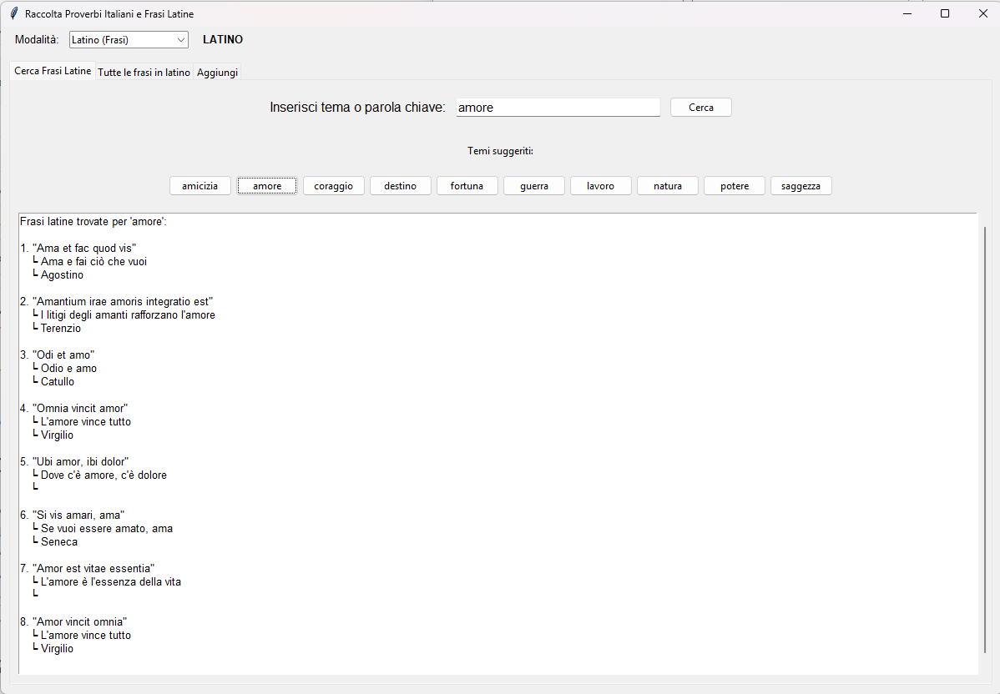

# Proverbi_Italiani
Un'applicazione desktop per esplorare proverbi italiani e frasi latine.

## ✨ Caratteristiche
- 🔍 Ricerca per tema in italiano e latino
- 📖 Visualizzazione completa di tutte le frasi
- ➕ Aggiunta nuovi proverbi
- ➕ Aggiunta nuove frasi latine e traduzioni
- 🏛️ Database separati per italiano e latino
- 🎯 Interfaccia intuitiva con tab dinamiche

## 📸 Screenshot

## 🚀 Download
<a href="https://github.com/Seconet/Proverbi_Italiani/blob/main/ProverbiItaliani.zip" target="_blank">[Link al file .exe]</a>

## 📜 Licenza
Freeware - Gratuito per uso personale - MIT License
